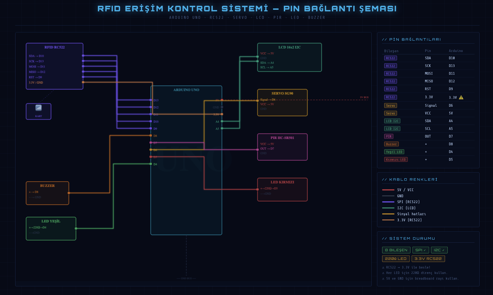
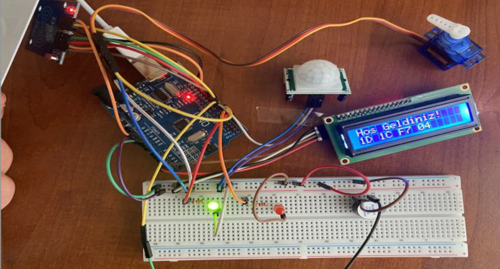
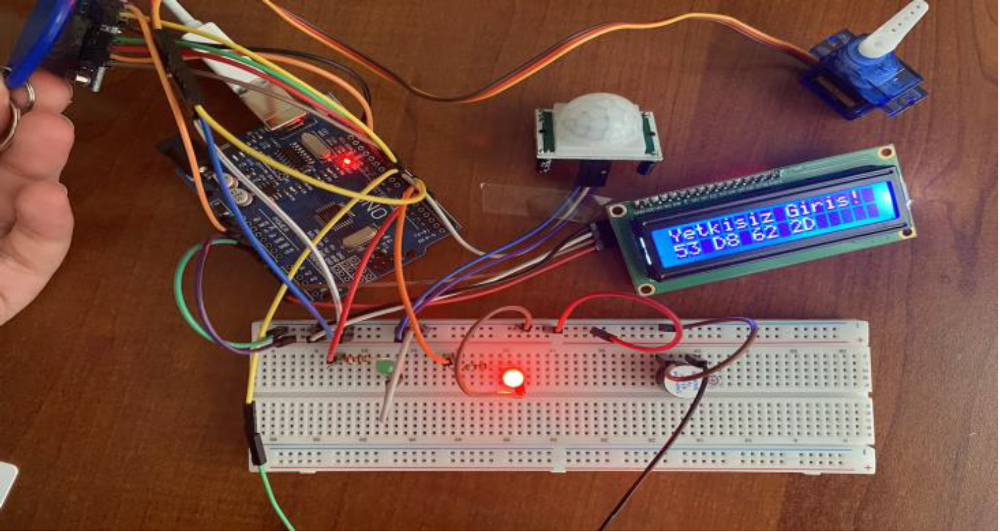

# Smart Apartment Visitor Entry System 🏢🔐

An IoT-based smart access control system that integrates Arduino hardware 
with a web-based visitor management panel. Built during internship at 
CYF TECH Software (March 2026).

## System Architecture
```
Arduino (C++) → Serial Port → Python Bridge → PHP REST API → MySQL Database
↓
Web Admin Panel
↓
Gmail SMTP Alert System
```
## Features

- RFID card-based access control (authorized / unauthorized scenarios)
- Real-time visitor logging to web-based database
- Automatic email alert to admin on unauthorized entry attempts (PHPMailer + Gmail SMTP)
- Web admin panel with full CRUD operations for RFID card management
- PIR motion sensor integration with debounce algorithm
- LCD display feedback + servo motor door simulation + LED & buzzer alerts

## Hardware Components

| Component | Purpose |
|---|---|
| Arduino Uno | Main microcontroller |
| RC522 RFID Module | Card reading via SPI protocol |
| 16x2 I2C LCD | User feedback display |
| Servo Motor | Door lock simulation |
| PIR Sensor | Motion detection |
| Green / Red LED | Visual access indicators |
| Active Buzzer | Audio alerts |

## Circuit Diagram



## Tech Stack

**Hardware:** `Arduino (C++)` `SPI` `I2C` `PWM`  
**Middleware:** `Python` `pyserial` `REST API`  
**Backend:** `PHP` `MySQL` `PHPMailer` `XAMPP`  
**Web:** `HTML` `CSS` `JavaScript`

## How It Works

1. RFID card is scanned on the Arduino
2. Arduino sends JSON data via Serial Port
3. `bridge.py` captures the data and forwards it to `rfid_api.php`
4. API checks the card UID against the `rfid_cards` database table
5. If authorized → servo opens, green LED, welcome message on LCD
6. If unauthorized → red LED, buzzer alarm, instant email alert to admin

## File Structure

```
├── arduino/
│   ├── prototypes/
│   │   ├── system1_pir_servo.ino
│   │   └── system2_rfid_full.ino
│   └── unit_tests/
│       ├── led_test.ino
│       ├── servo_test.ino
│       ├── lcd_test.ino
│       ├── pir_test.ino
│       └── rc522_test.ino
├── backend/
│   ├── bridge.py
│   ├── rfid_api.php
│   ├── rfid_cards.php
│   ├── rfid_card_create.php
│   ├── rfid_card_update.php
│   └── rfid_card_delete.php
├── circuit-diagram.png
└── README.md
```

## Demo

**Authorized access** — green LED, servo opens, welcome message on LCD:


**Unauthorized access** — red LED, buzzer alarm, warning on LCD:


## Setup

1. Upload `system2_rfid_full.ino` to Arduino via Arduino IDE
2. Connect components as shown in `circuit-diagram.png`
3. Set up XAMPP, import the MySQL schema
4. Run `python3 bridge.py` to start the middleware
5. Open the web panel via localhost

---

*This project was developed as part of an internship at CYF TECH Software, Manisa — 
combining embedded systems, IoT integration, and full-stack web development.*
